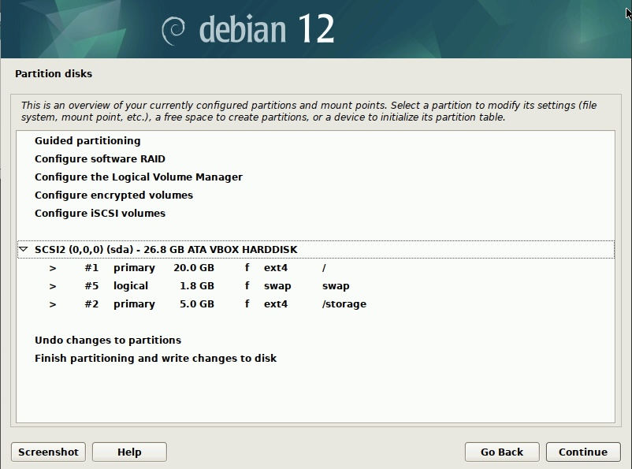

- # _INSTALASI DEBIAN 12_

## Step 1: Create Virtual Machine

1. Pilih New.

2. Beri nama sesuai keinginan, pilih direktori penyimpanan linux, dan pilih iso file yang telah diunduh.  

3. Sesuaikan jumlah memory ram dan cpu yang ingin dipakai.

4. Sesuaikan jumlah penyimpanan yang ingin dipakai.

5. Setelah selesai klik Finish.

## Step 2: Instalasi Debian

1. Pilih Graphical install.  

2. Pilih bahasa (English).  

3. Pilih negara asal (Indonesia).

4. Atur konfigurasi lokal.  

5. Pilih konfigurasi keyboard.

6. Atur hostname.

7. Atur domain network.

8. Atur password untuk root.

9. Atur nama lengkap.

10. Atur username.  

11. Atur password untuk linux.

12. Pilih zona waktu.  

13. Atur partisi secara manual.

14. Berikut adalah partisinya.

15. Pilih yes.  

16. Pilih extra installation media.

17. Pilih negara paket manager (Indonesia).

18. Pilih debian archive mirror.

19. Pilih software.  

20. Install grub boot loader (yes).

21. Instalasi BERHASIL!, pilih Continue.

## Step 3: Konfigurasi Awal

1. Selesaikan setup awal debian.
2. Setup selesai dan siap untuk digunakan. 

