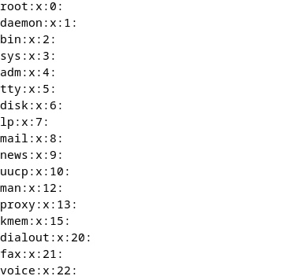

- # _TUGAS TAMBAHAN_

**<h1 style="font-family:bahnschrift;">- Role yang ada pada linux</h1>**
1. User (Pengguna):
    >Pengguna adalah individu yang dapat mengakses sistem. Masing-masing pengguna memiliki akunnya sendiri dengan hak akses tertentu.
    
    >Tugas: Mengelola file pribadi, menjalankan perintah di terminal, dan menggunakan sumber daya sistem.

2. Root (Superuser):

    >Root adalah pengguna dengan hak akses tertinggi. Hak akses root memungkinkan pengguna untuk melakukan perubahan sistem kritis.
    
    >Tugas: Menginstal dan menghapus perangkat lunak, mengelola pengguna, mengkonfigurasi sistem, dan melakukan tugas administratif lainnya.

3. Administrator (sudo):

    > Pengguna yang diberi hak akses khusus melalui konfigurasi sudo.   Administrator dapat menjalankan perintah dengan hak akses root sesaat.
    
    >Tugas: Menjalankan perintah dengan hak akses tambahan, membantu dalam administrasi sistem.

4. Sysadmin (Administrator Sistem):

    >Seorang administrator sistem memiliki tanggung jawab untuk merawat dan mengelola infrastruktur IT.

    >Tugas: Memastikan keamanan, ketersediaan, dan kinerja sistem, serta melakukan pemeliharaan dan pemecahan masalah.

5. Network Administrator (Administrator Jaringan):

    >Bertanggung jawab atas infrastruktur jaringan dan koneksi di dalam dan di luar sistem.

    > Tugas: Konfigurasi jaringan, pemecahan masalah koneksi, manajemen firewall, dan keamanan jaringan.

6. Database Administrator (Administrator Basis Data):

    > Bertanggung jawab atas manajemen dan kinerja basis data pada sistem.
    
    > Tugas: Pemasangan, konfigurasi, pemeliharaan, backup, dan pemulihan basis data.

7. Web Server (Pelayan Web):

    >Merujuk pada peran mesin yang menyediakan layanan web, seperti Apache atau Nginx.

    >Tugas: Menyajikan halaman web, menangani permintaan HTTP, dan menyediakan aplikasi web.

8. File Server (Pelayan File):

    >Berfungsi sebagai pusat penyimpanan dan distribusi file di dalam jaringan.

    >Tugas: Berbagi file, mengelola izin akses, dan menyediakan penyimpanan berbasis jaringan (NAS).

**<h1 style="font-family:bahnschrift;">- Perbedaan su dan su - pada linux</h1>**

  >command su pada linux memungkinkan user untuk mempertahankan current user environtment ketika switch user. Sedangkan su - digunakan untuk mengeksekusi shell login untuk transfer user account tertentu, serta secara umum mengubah environtment variables dan working directory set di environtmen milik user tertentu.

**<h3 style="font-family:bahnschrift;">Perintah su</h3>**

  Pada command ini, user dapat beralih ke user lain secara spesifik. Jika user tidak memilih user secara spesifik, maka linux secara default akan masuk ke root. Dengan menjalankan command su, ueser bisa switch ke user lain tanpa harus menjalankan login shell, dan environtment variables yang sudah di set pada akun saat ini tidak akan diubah.

- **contoh :** 
``` 
$ su qois
```
>dengan menjalankan perintah tersebut, user saat ini akan dialihkan ke user yang bernama 'qois' tanpa perlu menjalankan login shell, serta setting environtment variables yang tetap.

**<h3 style="font-family:bahnschrift;">Perintah su -</h3>**
    
  Pada command ini, user dapat beralih ke user lain, sama seperti perintah su. Namun, setting dari user saat ini akan diubah, dan environtment variables dari main user akan dihapus. 
- **contoh :**
```
$ su - qois
```
>perintah ini digunakan untuk beralih ke user 'qois' dengan menjalankan shell login. Jika user tidak menentukan user secara spesifik ke perintah ini, maka secara default user akan masuk ke Root.

**<h1 style="font-family:bahnschrift;">- Penjelasan mengenai $less /etc/group</h1>**

>Command ini akan membuka berkas group yang terletak di direktori /etc/ menggunakan less. less digunakan untuk melihat isi berkas secara bertahap dan memungkinkan untuk melakukan navigasi dengan lebih mudah. Kita dapat menggunakan tombol "Page Up" dan "Page Down", dan berbagai opsi lainnya untuk membaca dan menjelajahi isi berkas tersebut.
