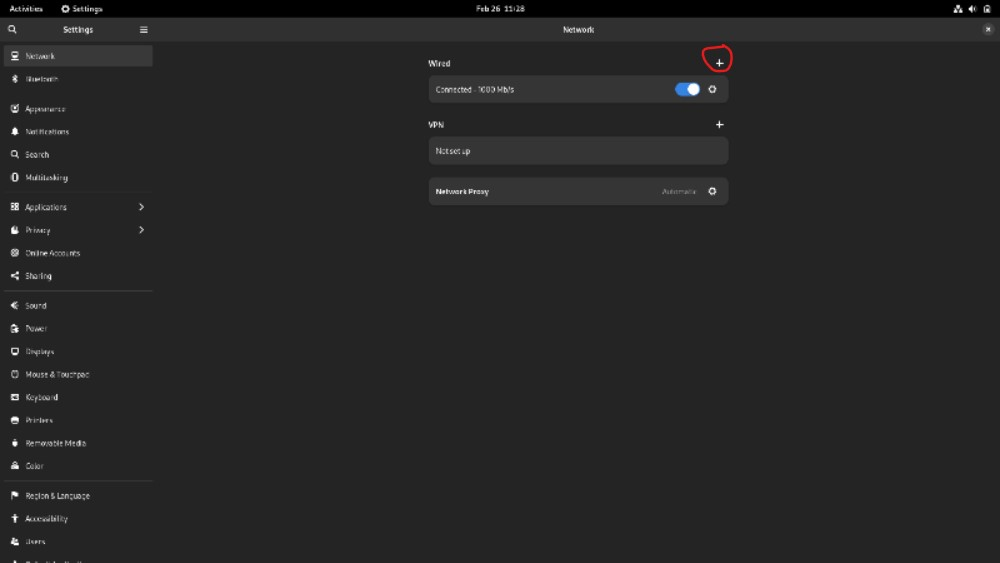
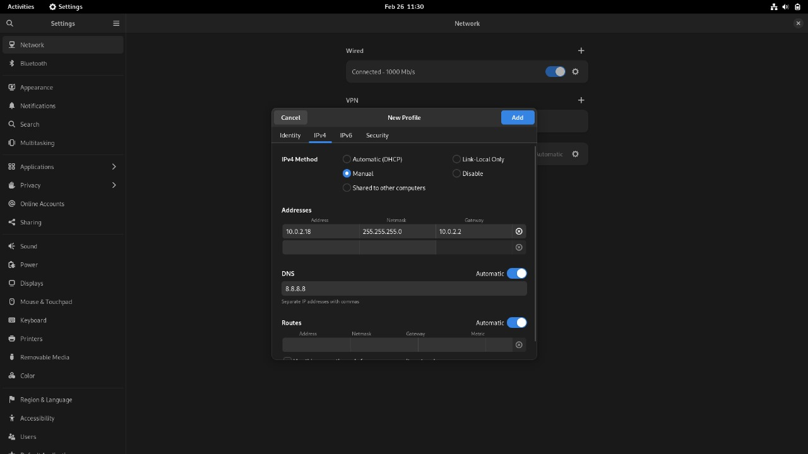
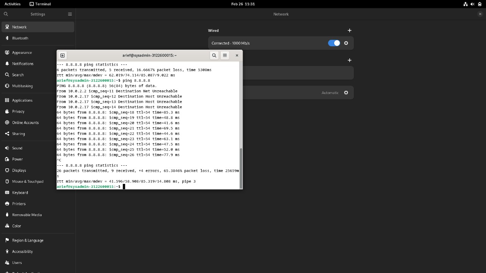

- # _Ubah DHCP ke Manual_ 
**<h3 style="font-family:bahnschrift;">1. Menuju ke setting->network lalu klik ikon + seperti pada gambar.</h3>**

    

 

#

**<h3 style="font-family:bahnschrift;">2. Ubah konfigurasi address dan DNS seperti pada gambar.</h3>**

    

#

**<h3 style="font-family:bahnschrift;">3. Tes ping ke DNS google melalui terminal.</h3>**

    

