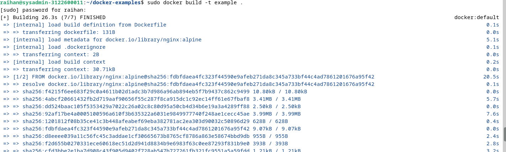
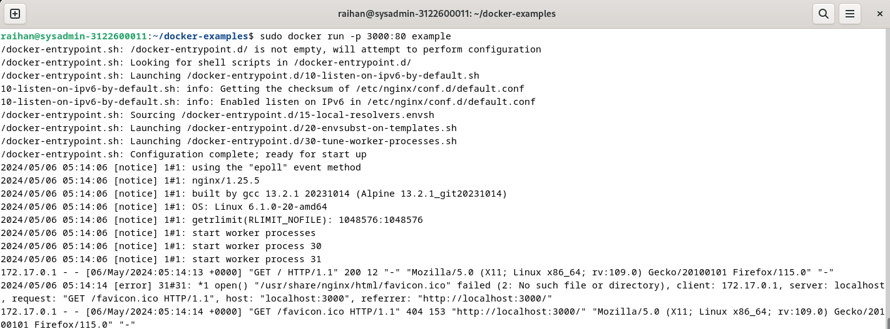
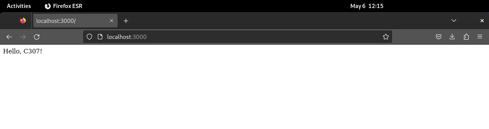

    Nama		     : Muhammad Qois Haidar
    NRP		         : 3122600001
    Kelas		     : 2 D4 Teknik Informatika A
    Mata Kuliah	     : Workshop Administrasi Jaringan
    Dosen Pengampu	 : Dr. Ferry Astika Saputra S.T., M.Sc
    

- # _DOCKER SIMPLE PROJECT_

## - CLONE PROJECT

- Lakukan git clone dari project docker-example: 
  - `git clone https://github.com/alfiyansys/docker-examples.git`
  
## - BUAT IMAGE DOCKER

- Masuk ke direktori docker-example:
  - `cd docker-examples`

- Membuat sebuah image Docker dari sebuah Dockerfile yang ada di direktori saat ini :
  - `sudo docker build -t example .`

      

## - MENJALANKAN DOCKER

- Jalankan sebuah container Docker dari sebuah image yang sudah ada:
  - `sudo docker run -p 3000:80 example`

      
    
- Jalankan pada firefox dengan mengetikkan:
  - `localhost:3000`
    
      
