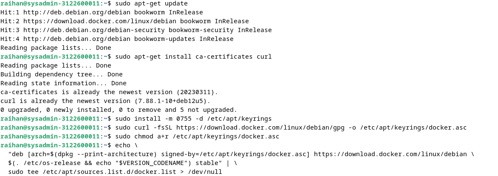
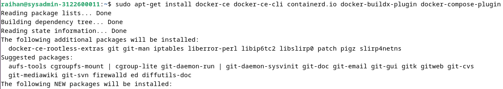
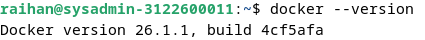
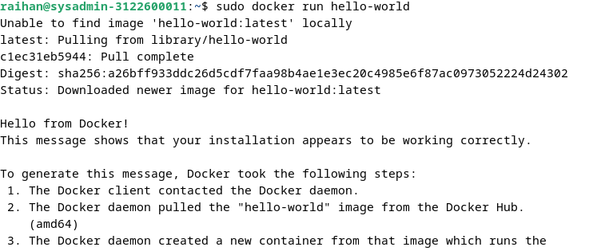

    Nama		     : Muhammad Qois Haidar
    NRP		         : 3122600001
    Kelas		     : 2 D4 Teknik Informatika A
    Mata Kuliah	     : Workshop Administrasi Jaringan
    Dosen Pengampu   : Dr. Ferry Astika Saputra S.T., M.Sc
    

- # _INSTALL DOCKER ENGINE DEBIAN 12_

## - MENGHAPUS VERSI LAMA (Jika sebelumnya pernah memasang)

- Ketik `for pkg in docker.io docker-doc docker-compose podman-docker containerd runc; do sudo apt-get remove $pkg; done`:
  
  

## - INSTALL DENGAN REPOSITORI APT

- Masukkan command berikut ini:
  - `sudo apt-get update`:
  - `sudo apt-get install ca-certificates curl`:
  - `sudo install -m 0755 -d /etc/apt/keyrings`:
  - `sudo curl -fsSL https://download.docker.com/linux/debian/gpg -o /etc/apt/keyrings/docker.asc`:
  - `sudo chmod a+r /etc/apt/keyrings/docker.asc`:
  - `echo \
  "deb [arch=$(dpkg --print-architecture) signed-by=/etc/apt/keyrings/docker.asc] https://download.docker.com/linux/debian \
  $(. /etc/os-release && echo "$VERSION_CODENAME") stable" | \
  sudo tee /etc/apt/sources.list.d/docker.list > /dev/null`:

      
  - `sudo apt-get update`:
    
      
  
## - INSTALL PAKET DOCKER

- Untuk memasang paket versi terbaru gunakan perintah ini:
  - `sudo apt-get install docker-ce docker-ce-cli containerd.io docker-buildx-plugin docker-compose-plugin`:
    
      
    
- Cek versi Docker:
  - `docker --version`:
    
      

## - VERIFIKASI

- Untuk memverifikasi bahwa penginstalan berhasil gunakan perintah:
  - `sudo docker run hello-world`:
    
      
