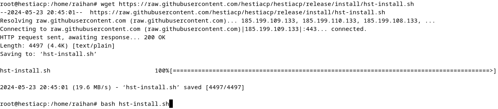
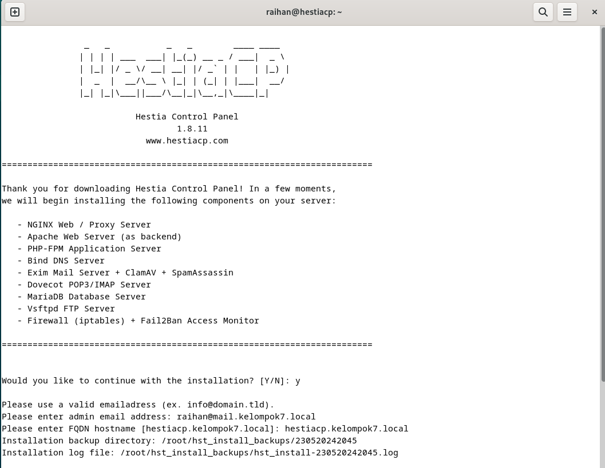
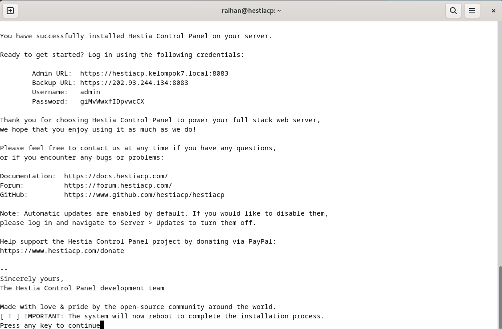
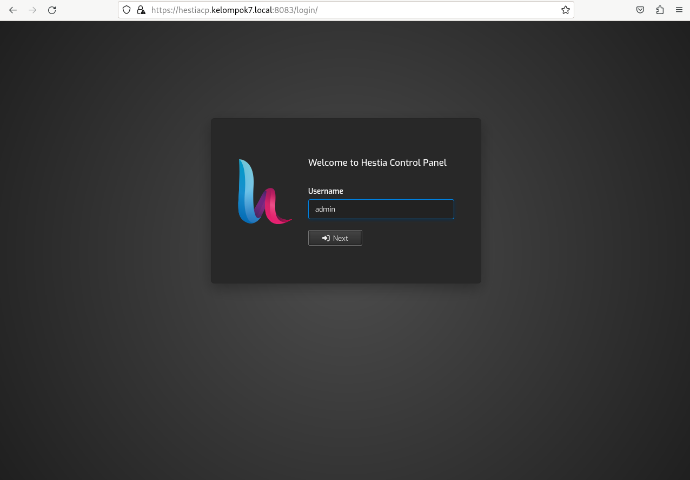
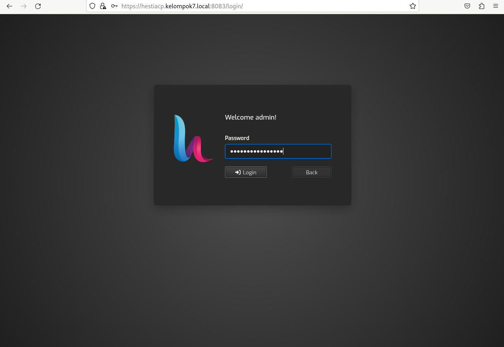
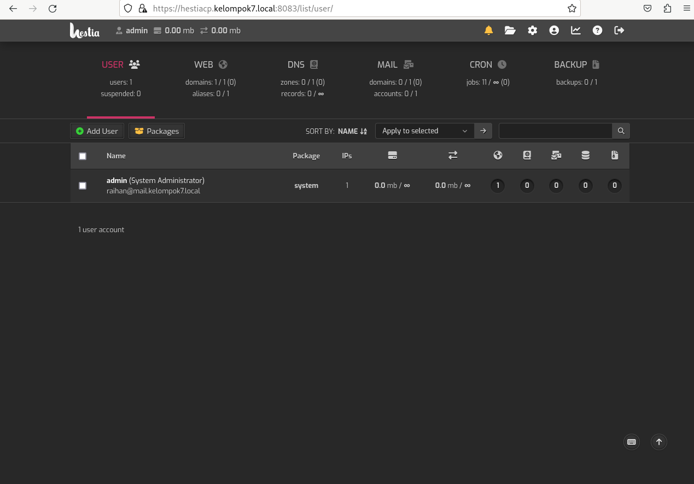

    Nama		      : Muhammad Qois Haidar
    NRP		          : 3122600001
    Kelas		      : 2 D4 Teknik Informatika A
    Mata Kuliah	      : Workshop Administrasi Jaringan
    Dosen Pengampu	  : Dr. Ferry Astika Saputra S.T., M.Sc
    

- # _HESTIACP_

## - INSTALASI

1. Lakukan instalasi vm debian terlebih dahulu.
2. Setelah debian selesai terinstall, buka terminal dan masuk ke root.
3. Install hestiacp dengan perintah berikut.
   ```bash
   wget https://raw.githubusercontent.com/hestiacp/hestiacp/release/install/hst-install.sh
   ```
4. Jalankan perintah berikut untuk konfigurasi lebih lanjut.
   ```bash
   bash hst-install.sh
   ```


5. Lalu masukkan email & FQDN hostname seperti gambar berikut.
   

6. Setelah itu tunggu proses selama kurang lebih 10 - 15 menit.
   
   
7. Setelah berhasil terinstall akan diberikan URL, username, dan password untuk login ke control panel.
   

8. Catatlah url hingga password, lalu tekan sembarang tombol untuk reboot sistem.

## - AKSES CONTROL PANEL

1. Salin url yang telah diberikan tadi ke browser.
   ```bash
   https://hestiacp.kelompok7.local:8083
   ```

2. Lalu login dengan username dan password yang telah diberikan sebelumnya.
   
   

4. Setelah berhasil login, tampilan control panelnya seperti berikut.
   
