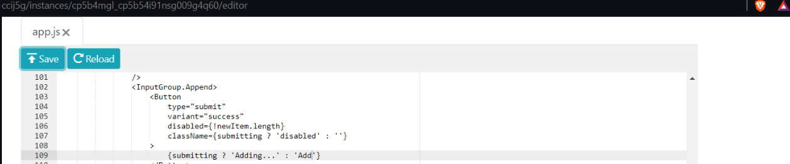
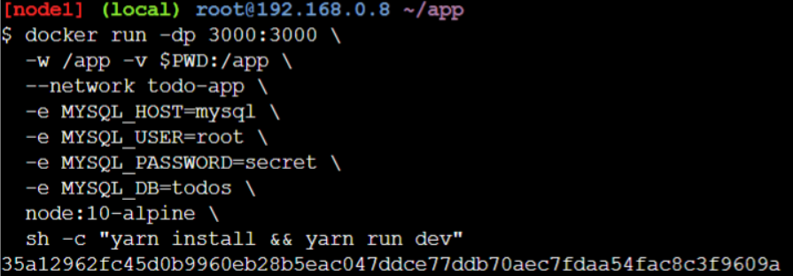

    Nama		     : Muhammad Qois Haidar
    NRP		         : 3122600001
    Kelas		     : 2 D4 Teknik Informatika A
    Mata Kuliah	     : Workshop Administrasi Jaringan
    Dosen Pengampu   : Dr. Ferry Astika Saputra S.T., M.Sc
    

- # _DOCKER 101_

## - GETTING STARTED

1. Setelah masuk ke labs buat instance baru.
2. Setelah terminal muncul masukkan kode berikut untuk membuka port 80 yang berisi tutorial.
   ```bash
   docker run -dp 80:80 docker/getting-started:pwd
   ```


## - OUR APPLICATION

1. Download file app.zip pada laman tutorial.
2. Ekstrak file tersebut dengan mengetikkan kode berikut pada terminal.
   ```bash
   unzip app.zip
   ```
   

3. Pindah ke direktori app dengan perintah.
   ```bash
   cd app/
   ```
4. Lihat isi dari direktori dengan perintah
   ```bash
   ls
   ```
5. Buat dan isi file bernama Dockerfile dengan perintah.
   ```bash
   touch Dockerfile
   vi Dockerfile
   ```


6. Tambahkan kode berikut ke dalam file.
   ```bash
    FROM node:10-alpine
    WORKDIR /app
    COPY . .
    RUN yarn install --production
    CMD ["node", "/app/src/index.js"]
   ```
   

7. Buat Container Image dengan perintah.
   ```bash
   docker build -t docker-101 .
   ```
   

8. Memulai kontainer dengan perintah.
   ```bash
   docker run -dp 3000:3000 docker-101
   ```
   
   
9. Tekan port 3000 dan hasil akan seperti berikut.
   

## - UPDATING OUR APP

1. Edit code pada file app.js dengan perintah berikut.
   ```bash
   vi ~/app/src/static/js/app.js
   ```

2. Hapus code pada line 56 dan ganti dengan.
   ```bash
    <p className="text-center">You have no todo items yet! Add one above!</p>
   ```
   

3. Update image dengan perintah.
   ```bash
    docker build -t docker-101 .
   ```
   

4. Jalankan container baru dengan perintah.
   ```bash
    docker run -dp 3000:3000 docker-101
   ```
   
   
5. Terdapat error karena port 3000 masih dipakai, jadi perlu menghapus port lama dan memulainya kembali.
   ```bash
   docker ps
   docker stop <the-container-id>
   docker rm <the-container-id>
   ```
   

6. Tekan port 3000 yang baru dan hasilnya seperti berikut.
   

## - SHARING OUR APP

1. Login terlebih dahulu ke Docker Hub dan buat repository baru bernama '101-todo-app' dengan visibilitas public.
   

2. Push ke repo dengan perintah.
   ```bash
   docker push dockersamples/101-todo-app
   ```
   
   
3. Terjadi error karena nama 'dockersamples' tidak sesuai sehingga perlu dilakukan login terlebih dahulu.
   ```bash
   docker login -u YOUR-USER-NAME
   ```
   

4. Setelah login kita lakukan kembali dengan memberikan tag.
   ```bash
   docker tag docker-101 YOUR-USER-NAME/101-todo-app
   ```
   

5. Coba push kembali dengan perintah.
   ```bash
   docker push YOUR-USER-NAME/101-todo-app
   ```
   

6. Buat instance baru dan jalankan kode berikut.
   ```bash
   docker run -dp 3000:3000 YOUR-USER-NAME/101-todo-app
   ```
   
   
7. Buka port 3000 dan hasilnya seperti berikut.
   

## - PERSISTING OUR DB

1. Mulai kontainer ubuntu dengan perintah.
   ```bash
   docker run -d ubuntu bash -c "shuf -i 1-10000 -n 1 -o /data.txt && tail -f /dev/null"
   ```
   

2. Untuk mengecek isi file data.txt kita perlu jalankan perintah berikut.
   ```bash
   docker ps
   docker exec <container-id> cat /data.txt
   ```
   
   
3. Kita cek apakah file data.txt ada didalam ubuntu dengan.
   ```bash
   docker run -it ubuntu ls /
   ```
   

4. hapus container ubuntu pertama kita tadi dengan.
   ```bash
   docker rm -f <container-id>
   ```
   

5. Buat volume baru dengan nama todo-db.
   ```bash
   docker volume create todo-db
   ```
   

6. Jalankan kontainer todo dengan port 3000.
   ```bash
   docker run -dp 3000:3000 -v todo-db:/etc/todos docker-101
   ```

7. Tekan port 3000 dan coba masukkan beberapa data.

   

8. Hapus port 3000 dan coba mulai ulang seperti kode nomor 5.

   

9. Buka lagi dan hasilnya bisa dilihat data masih tersimpan.

   

10. Jika ingin mengetahui di mana Docker menyimpan data kita jika menggunakan named volume, kita bisa menggunakan.
    ```bash
    docker volume inspect <name>
    ```
    

## - USING BIND MOUNTS

1. Pastikan bahwa kita tidak mempunyai container docker-101 yang masih berjalan.

   

2. Jalankan command berikut.
   ```bash
   docker run -dp 3000:3000 \
        -w /app -v $PWD:/app \
        node:10-alpine \
        sh -c "yarn install && yarn run dev"
   ```

3. Jalankan perintah berikut, dan jika bisa Listening on port 3000 maka sudah bisa digunakan.
   ```bash
   docker logs -f <container-id>
   ```
   

4. Kita ubah tombol "Add Item" menjadi "Add" di.
   ```bash
   src/static/js/app.js
   ```
   

5. Jalankan port 3000 dan kita bisa melihat bahwa tombol sudah berubah menjadi "Add".

   

6. Kita bisa bebas membuat perubahan sesuka kita. Jika sudah selesai, stop containernya dan build imagenya dengan.
   ```bash
   docker build -t docker-101 .
   ```

## - MULTI-CONTAINER APPS

1. Buat networknya dengan.
   ```bash
   docker network create todo-app
   ```
   
   
2. Jalankan MySQL container dan attach ke network. Jalankan command.
   ```bash
   docker run -d \
        --network todo-app --network-alias mysql \
        -v todo-mysql-data:/var/lib/mysql \
        -e MYSQL_ROOT_PASSWORD=secret \
        -e MYSQL_DATABASE=todos \
        mysql:5.7
   ```
   

3. Jalankan kode berikut untuk mengonfirmasi bahwa database kita sudah berjalan.
   ```bash
   docker exec -it <mysql-container-id> mysql -p
   ```
   

4. Cek database yang tersedia dengan menjalankan.
   ```bash
   SHOW DATABASES;
   ```
   

5. Jalankan container baru dengan.
   ```bash
   docker run -it --network todo-app nicolaka/netshoot
   ```

6. Jalankan perintah berikut untuk mendapatkan IP address.
   ```bash
   dig mysql 
   ```
   

7. Jalankan command berikut untuk specify environment variables dan connect ke container.
   ```bash
   docker run -dp 3000:3000 \
      -w /app -v $PWD:/app \
      --network todo-app \
      -e MYSQL_HOST=mysql \
      -e MYSQL_USER=root \
      -e MYSQL_PASSWORD=secret \
      -e MYSQL_DB=todos \
      node:10-alpine \
      sh -c "yarn install && yarn run dev"
   ```
   

8. Kita cek lognya dengan perintah berikut dan nanti akan ada pesan yang memberitahu bahwa sedang menggunakan database mysql.
   ```bash
   docker logs <container-id>
   ```
   

9. Buka web to-do-listnya di port 3000 dan tambahkan beberapa item.

   
   
10. Lalu connect ke mysql databasenya dengan docker exec. Lalu jalankan perintah select. Terlihat bahwa aplikasi kita berhasil connect ke database mysql.
    ```bash
    docker exec -ti <mysql-container-id> mysql -p todos
    select * from todo_items;
    ```
    

## - USING DOCKER COMPOSE

1. Karena kita menggunakan Play-with-Docker instance, maka Docker Compose sudah ter-install. Kita cek versinya dengan perintah.
   ```bash
   docker-compose version
   ```
   

2. Di folder app, buat file bernama docker-compose.yml.

3. Lalu isi filenya seperti berikut ini.

   

4. Pertama, mari kita definisikan service entry dan image untuk container. Kita bisa memilih nama apa saja untuk service tersebut. Nama ini secara otomatis akan menjadi alias jaringan, yang akan berguna saat mendefinisikan service MySQL kita.

Biasanya, perintah ditempatkan dekat dengan definisi image, meskipun tidak ada persyaratan khusus untuk urutannya. Jadi, mari kita pindahkan itu ke dalam file kita.

Mari kita migrasi bagian -p 3000:3000 dengan mendefinisikan ports untuk service.

Selanjutnya, kita akan migrasi direktori (-w /app) dan mapping volume (-v $PWD:/app) menggunakan definisi working_dir dan volumes.

Salah satu keuntungan dari volume Docker Compose adalah kita bisa menggunakan jalur relatif dari direktori saat ini.

Terakhir, kita perlu migrasi definisi environment variables menggunakan key environment.

File docker-compose.yml akan menjadi seperti ini.
   
   

5. Pertama, kita akan mendefinisikan layanan baru dan menamainya mysql sehingga secara otomatis mendapatkan alias jaringan. Kita juga akan menentukan image yang akan digunakan.

Selanjutnya, kita akan mendefinisikan pemetaan volume. Saat kita menjalankan container dengan docker run, volume bernama dibuat secara otomatis. Namun, itu tidak terjadi saat menjalankan dengan Compose. Kita perlu mendefinisikan volume di bagian top-level volumes: dan kemudian menentukan mountpoint dalam konfigurasi layanan. Dengan hanya menyediakan nama volume, opsi default akan digunakan. Namun, tersedia banyak opsi lain.

Terakhir, kita hanya perlu menentukan environment variables.

File docker-compose.yml akan menjadi seperti ini.
   
   

6. File docker-compose.yml sudah siap digunakan.

   

7. Jalankan perintah.
   ```bash
   docker-compose up -d
   ```
   

8. Mari kita lihat log menggunakan perintah docker-compose logs -f. Kita akan melihat log dari masing-masing layanan terjalin menjadi satu stream. Ini sangat berguna saat kita ingin memantau masalah terkait waktu. Flag -f "mengikuti" log, sehingga memberikan output langsung saat log dihasilkan.

   

9. Lalu kita harusnya sudah bisa membuka aplikasi to-do-listnya lagi.

   

10. Jika ingin menghentikan docker compose, gunakan perintah.
    ```bash
    docker-compose down
    ```

## - IMAGE BUILDING BEST PRACTICES

1. Gunakan docker image history untuk melihat layer-layer di image docker-101. Setiap baris mewakili sebuah layer dalam image. Tampilan di sini menunjukkan layer dasar di bagian bawah dengan layer terbaru di bagian atas. Dengan ini, kita juga dapat dengan cepat melihat ukuran setiap layer, membantu mendiagnosis image yang besar.

   

2. Jalankan perintah berikut. Kita akan melihat bahwa beberapa baris terpotong. Jika kita menambahkan flag --no-trunc, kita akan mendapatkan output lengkap.
   ```bash
   docker image history --no-trunc docker-101
   ```
   

3. Ubah Dockerfile menjadi seperti berikut.
   
   

4. Build image baru dengan perintah.
   ```bash
   docker build -t docker-101 .
   ```

5. Ubah title di src/static/index.html menjadi "The Awesome Todo App".
   
   

6. Build lagi imagenya dengan perintah berikut. Buildnya akan menjadi lebih cepat karena menggunakan cache.
   ```bash
   docker build -t docker-101 .
   ```
