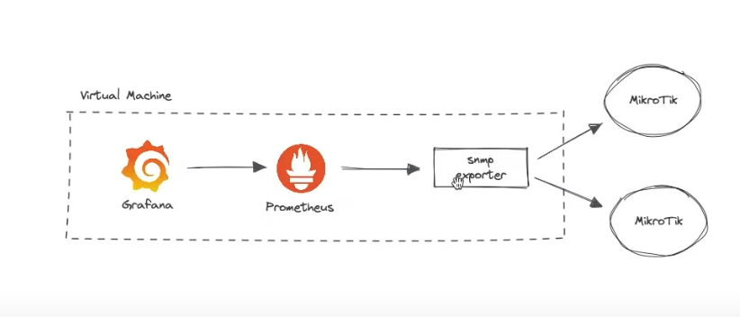

Monitoring MikroTik lab jarkom C307 Menggunakan Grafana dan Prometheus

1.	Pendahuluan
Lab Jaringan Komputer C-307 menggunakan jaringan MikroTik untuk mengelola infrastruktur jaringannya. Monitoring terhadap performa dan kesehatan perangkat ini masih dilakukan secara manual dan tidak real-time, yang menghambat deteksi dini terhadap masalah jaringan. Untuk meningkatkan visibilitas dan pengelolaan jaringan, diperlukan solusi monitoring yang andal dan real-time. Prometheus dan Grafana adalah alat open-source yang dapat memenuhi kebutuhan ini dengan mengumpulkan, menyimpan, dan menganalisis metrik dari perangkat MikroTik.

2.	Ruang Lingkup
Instalasi dan Konfigurasi Prometheus:
- Setup server Prometheus untuk pengumpulan metrik dari perangkat MikroTik.
- Konfigurasi job dan scraping target untuk MikroTik.

Instalasi dan Konfigurasi Grafana:
- Setup server Grafana untuk visualisasi data metrik dari perangkat MikroTik.
- Integrasi Grafana dengan Prometheus sebagai data source.

Integrasi dengan Perangkat MikroTik yang Ada:
- Konfigurasi SNMP (Simple Network Management Protocol) pada perangkat MikroTik.
- Setup exporter yang diperlukan untuk mengumpulkan metrik dari MikroTik ke Prometheus.

Pembuatan Dashboard dan Laporan:
- Desain dan implementasi dashboard khusus untuk monitoring perangkat MikroTik di Grafana.
- Konfigurasi notifikasi dan alert untuk kondisi kritis pada perangkat MikroTik.
Penyusunan Dokumentasi
- Dokumentasi lengkap untuk instalasi, konfigurasi, dan penggunaan sistem monitoring perangkat MikroTik.
- Penyusunan panduan troubleshooting dan FAQ.

3.	Desain Sistem

Arsitektur Sistem:
- Prometheus Server: Mengumpulkan dan menyimpan metrik dari perangkat MikroTik melalui SNMP Exporter.
- Grafana Server: Menyediakan antarmuka visualisasi untuk data metrik yang dikumpulkan oleh Prometheus.
- MikroTik Devices: Perangkat jaringan yang di-monitoring, dikonfigurasi untuk mengirimkan metrik melalui SNMP.

Komponen Utama:
- Prometheus: Server monitoring yang mengumpulkan metrik dari berbagai sumber.
- Grafana: Alat visualisasi yang menampilkan data metrik dalam bentuk dashboard interaktif.
- SNMP Exporter: Komponen yang digunakan untuk mengambil metrik dari perangkat MikroTik dan mengirimkannya ke Prometheus.

Diagram Alir Sistem:
1. MikroTik Devices → Mengirim metrik melalui SNMP → SNMP Exporter
2. SNMP Exporter → Mengirim data metrik ke → Prometheus Server
3. Prometheus Server → Menyimpan dan menyediakan data metrik untuk → Grafana Server
4. Grafana Server → Menampilkan data metrik dalam dashboard interaktif dan mengirim notifikasi jika ada anomali.

4.	Team
Manajer Proyek:
- Team.

Tim Teknis:
- Tim Jaringan: Bertanggung jawab atas konfigurasi dan pemeliharaan perangkat MikroTik (team).
- Tim Infrastruktur: Mengelola server Prometheus dan Grafana (team).
- Tim Keamanan: Memastikan bahwa solusi monitoring mematuhi kebijakan keamanan perusahaan (team).

Pengguna Akhir:
- Semua staf lab.

5.	Tahapan
Tahap Perencanaan (27 Mei 2024):
- Analisis kebutuhan dan penyusunan rencana proyek.
- Identifikasi perangkat MikroTik yang akan di-monitoring.

Tahap Pengaturan Infrastruktur(27 Mei 2024):
- Instalasi server Prometheus dan Grafana.
- Setup jaringan dan konfigurasi dasar untuk server monitoring.

Tahap Implementasi dan Integrasi(27 Mei 2024):
- Konfigurasi SNMP pada perangkat MikroTik.
- Instalasi dan konfigurasi SNMP Exporter.
- Integrasi Prometheus dengan MikroTik melalui SNMP Exporter.
- Integrasi Prometheus dengan Grafana.

Tahap Pengujian dan Validasi(28 Mei 2024):
- Pengujian sistem monitoring dan validasi metrik yang dikumpulkan.
- Penyesuaian konfigurasi berdasarkan hasil pengujian.

Tahap Pelatihan dan Dokumentasi(28 Mei 2024):
- Penyusunan dokumentasi lengkap untuk instalasi, konfigurasi, dan penggunaan.
- Pelatihan untuk tim terkait dalam penggunaan dan pemeliharaan sistem monitoring.

Peluncuran Proyek(29 Mei 2024):
- Peluncuran sistem monitoring ke lingkungan produksi.
- Monitoring awal dan penyesuaian akhir.

